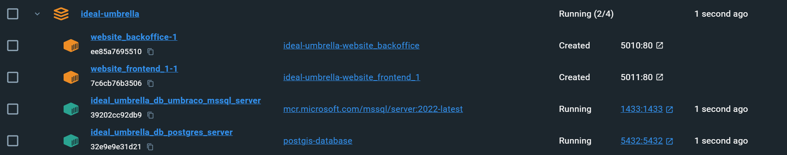
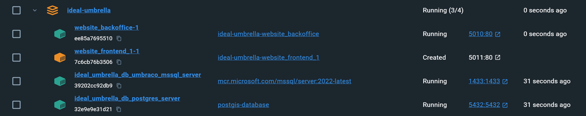
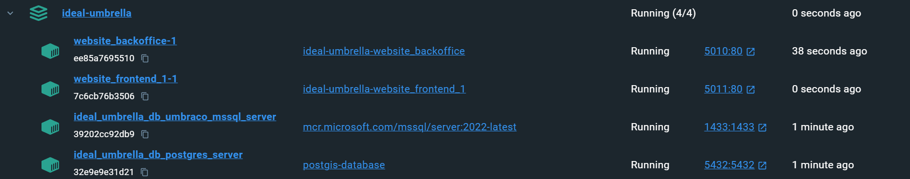
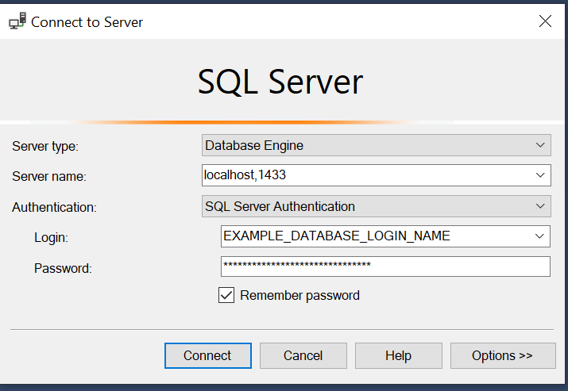

# Ideal Umbrella 🌂

## Build Status

[](https://github.com/liamlaverty/ideal-umbrella/actions/workflows/docker-all-apps-run.yml)
[](https://github.com/liamlaverty/ideal-umbrella/actions/workflows/docker-all-apps-run.yml)

## What is this?
Climate data in Postgres and Umbraco12, hosted in Ubuntu Docker containers. The project can be run from Docker on either Windows, Mac, or Linux machines. 

**Contents**:
- [Ideal Umbrella 🌂](#ideal-umbrella-)
  - [What is this?](#what-is-this)
- [Docker](#docker)
  - [Quick-start Docker](#quick-start-docker)
  - [Full Docker Install](#full-docker-install)
  - [Full Docker Uninstall](#full-docker-uninstall)
  - [Install Docker Platform](#install-docker-platform)
  - [Docker MSSQL Server on Apple Silicon](#docker-mssql-server-on-apple-silicon)
  - [Docker Healthcheck conditions](#docker-healthcheck-conditions)
      - [MSSQL health](#mssql-health)
      - [Postgres health](#postgres-health)
      - [Umbraco Backoffice health](#umbraco-backoffice-health)
      - [Umbraco Frontend(s) health](#umbraco-frontends-health)
  - [Connect to Docker Services](#connect-to-docker-services)
    - [Postgres](#postgres)
    - [MSSQL](#mssql)
      - [SA User](#sa-user)
      - [Umbraco User](#umbraco-user)
    - [Umbraco](#umbraco)
  - [Docker `.env` environment variables](#docker-env-environment-variables)
      - [General Settings](#general-settings)
      - [Postgres Server Admin Credentials](#postgres-server-admin-credentials)
      - [Database Server Admin credentials:](#database-server-admin-credentials)
      - [Umbraco database credentials:](#umbraco-database-credentials)
      - [Database config](#database-config)
      - [Umbraco unattended installs](#umbraco-unattended-installs)
      - [Mapbox config](#mapbox-config)
- [CI/CD \& Github Actions](#cicd--github-actions)
  - [Carbon Aware Github actions](#carbon-aware-github-actions)
- [Development](#development)
  - [Configure User secrets](#configure-user-secrets)
      - [Secrets to set](#secrets-to-set)
  - [Run the application](#run-the-application)
    - [VSCode](#vscode)
    - [Visual Studio](#visual-studio)
- [References \& resources](#references--resources)


# Docker

The applications can be hosted in Docker. The documentation expects you have [Docker Desktop](https://www.docker.com/products/docker-desktop/) installed.

Installs the following:

- Microsoft MSSQL Server with Umbraco database & user preconfigured
- Postgres SQL Server with preconfigured climate data tables
- Umbraco backoffice dotnet application 
- Umbraco frontend dotnet application 

## Quick-start Docker
If you're just looking around, run the following commands to quick-install the applications:
```bash
docker volume create ideal_umbrella_postgres_data
docker compose --env-file ./.env.example up --build 
```

*Note* this uses credentials stored in git, do not use the `.env.example` file for anything but local development. See [Detail](#docker-env-environment-variables) for full setup details

## Full Docker Install

If you don't have the Docker platform installed, run through [Install Docker Platform](#install-docker-platform), then come back to this step.

1. Create a volume for your postgres data to persist on 

```bash
docker volume create ideal_umbrella_postgres_data
```
 
2. Copy contents of `.env.example` into `.env`
3. Adjust the values in `.env` *these are secrets, do not commit them*
4. Run the command to deploy the applications into docker containers

```bash
docker compose up --build
```

The first time you run `docker compose` for the project, it will take a long time. The command will download MSSQL Server, Postgres, and Dotnet, then build the applications, then launch them. 

You should be able to see the startup progress in Docker Desktop after a few minutes. 

**1. Database Running**


**2. Backoffice Running**


**3. Frontend Running**


- Visit http://localhost:5010 for the backoffice or http://localhost:5011 for the front-end


## Full Docker Uninstall
To clear down the docker application & revert the installation
1. Run the `down` command:

```bash 
docker compose down --rmi local --volumes
```
2. remove the persisted postgres volume

```bash
docker volume rm ideal_umbrella_postgres_data
```

## Install Docker Platform

Download and install [Docker Desktop 🔗](https://www.docker.com/products/docker-desktop/). This will include all of [Docker 🔗](https://www.docker.com/) in one package, and makes interacting with Docker much easier. This guide mostly uses terminal commands, but Docker Desktop will make the process simpler.

## Docker MSSQL Server on Apple Silicon

If you're using a first generation Apple Silicon Mac, you will need to configure Rosetta Emulation to get MSSQL server running:

- Open docker desktop
- Click the Settings cog in the top right
- In the *General* tab, make sure *Use virtualization framework* is set to `true`
- Click *Features in Development*
- Set *Use Rosetta for x86/amd64 emulation on Apple Silicon* to `true`
  

## Docker Healthcheck conditions
Containers check their health on startup. Some services depend on another service's healthcheck returning positive before starting up.

#### MSSQL health
* Depends on no other container

The MSSQL container startup creates a database & user for the Umbraco applications. It will report *Unhealthy* until the Umbraco database & user is created. 

#### Postgres health
* Depends on no other container

The Postgres container uses the built-in `pg_isready` command to report its health.

#### Umbraco Backoffice health
* Depends on [MSSQL/Healthy](#mssql-health)

The Umbraco Backoffice container will wait for the MsSQL container's *healthy* prompt before starting up.

It will report *Unhealthy* until a 200 is returned. On first launch, this will be after uSync has completed its import.

#### Umbraco Frontend(s) health
* Depends on [MSSQL/Healthy](#mssql-health) & [Umbraco Backoffice/Healthy](#umbraco-backoffice-health)

The Umbraco backoffice will wait for the Umbraco Backoffice container to report Healthy

## Connect to Docker Services
Details below assume you've not changed the settings in `.env.example`. You should change those settings & adjust the below accordingly


### Postgres
In Datagrip, setup the following to login:

- `Name`: example_postgres_sql_server_db@127.0.0.1
- `Comment`: example_postgres_sql_server_db is a docker container
- `Host`: 127.0.0.1
- `Port`: 5432
- `Authentication`: User & Password
- `User`: POSTGRES_DB_CLIMATEDB_ADMIN_USER
- `Password`: POSTGRES_DB_CLIMATEDB_ADMIN_P@ssWORD
- `Database`: POSTGRES_DB_CLIMATEDB

### MSSQL 
In SQL Server Management Studio setup the following to login:

#### SA User

- `Server Type`: Database Engine
- `Server Name:`: localhost,1433
- `Athentication`: SQL Server Authentication
- `Login`: sa
- `Password`: YOUR_PASS_goes_HERE@

Optionally, click the Options button, then configure:

- `Connect to database`: EXAMPLE_UMBRACO_DATABASE_NAME 

#### Umbraco User
- `Server Type`: Database Engine
- `Server Name:`: localhost,1433
- `Athentication`: SQL Server Authentication
- `Login`: EXAMPLE_DATABASE_LOGIN_NAME
- `Password`: EXAMPLE_DATABASE_LOGIN_P@ssword

Click the Options button, then configure:

- `Connect to database`: EXAMPLE_UMBRACO_DATABASE_NAME 



### Umbraco

The Umbraco application should be launched in localhost:

- Backoffice: http://localhost:5010/umbraco
- Frontend: http://localhost:5011/

## Docker `.env` environment variables

In this example, configs are set in the `.env` file. When pulling the repository initially, you'll need to copy `.env.example` into `.env`. You should change the values in `.env`. Ideally these should be moved into [Docker Secrets](https://docs.docker.com/compose/use-secrets/) 

#### General Settings
- `PROJECT_FRIENDLY_NAME` is a friendly name for your project - it's used in Docker to name some containers and networks

#### Postgres Server Admin Credentials
- `POSTGRES_DATABASE_SERVER_AND_CONTAINER_NAME`, the login credential for your Posgres admin user
- `POSTGRES_DATABASE_DB`, the login credential for your Posgres admin user
- `POSTGRES_DATABASE_USER`, the login credential for your Posgres admin user
- `POSTGRES_DATABASE_PASSWORD`,  the login credential for your Posgres admin user
POSTGRES_DATABASE_DATA='/data/example-postgres-data'

#### Database Server Admin credentials:

- `UMBRACO_DATABASE_SERVER_SA_USERNAME` defualts to `sa`
- `UMBRACO_DATABASE_SERVER_SA_PASSWORD` Should be a string, and should confirm to Microsoft's SA password restrictions (at least 8 characters, with uppercase, lowercase, numbers and symbols)

#### Umbraco database credentials:
- `UMBRACO_DATABASE_USERNAME_STRING`, your Umbraco database user's username
- `UMBRACO_DATABASE_PASSWORD_STRING`, your Umbraco database user's password. Should confirm to Microsoft's database password restrictions (at least 8 characters, with uppercase, lowercase, numbers and symbols)

#### Database config
- `UMBRACO_DATABASE_SERVER_AND_CONTAINER_NAME`, this is the name of the container your database will live in. You'll sometimes use this value instead of `localhost` when connecting to the database from inside of another docker container
- `UMBRACO_DATABASE_NAME`, this is your Umbraco database's name

#### Umbraco unattended installs
These settings match the [Umbraco Unattended Install 🔗](https://docs.umbraco.com/umbraco-cms/fundamentals/setup/install/unattended-install) variables
- `UMBRACO_CMS_UNATTENDED_INSTALLUNATTENDED`, allows you to configure unattended installations. If this is set to `false`, the `website-frontend` container won't startup until after you've run a manual installation
- `UMBRACO_CMS_UNATTENDED_UNATTENDED_USERNAME`, the default user's username for an unattended install
- `UMBRACO_CMS_UNATTENDED_UNATTENDED_EMAIL`, the default user's email for an unattended install
- `UMBRACO_CMS_UNATTENDED_UNATTENDED_PASSWORD`, the default user's password for an unattended install

#### Mapbox config
- `MAPBOX_FRONTEND_KEY`, your mapbox front-end key. It should begin `pk`, and it should be configured to allow use on your domain. For localhost, you'll need to include the port number

# CI/CD & Github Actions
Details of the github actions, and CI/CD process are below:

## Carbon Aware Github actions 
The site uses the Green Software Foundation's carbon aware API via Stebje's github action: https://github.com/stebje/jord. This will delay the build action if there is a greener time to run it in the near future.  


# Development
Steps to launch the application(s) are detailed below:

## Configure User secrets

To enable user secrets in dev, follow the guide: https://learn.microsoft.com/en-us/aspnet/core/security/app-secrets?view=aspnetcore-7.0&tabs=windows#secret-manager

- Run `dotnet user-secrets init` to init the user secret feature in your dev env
- Set secrets with `dotnet user-secrets set "json:path:to:your:secrete:key" "value"`

#### Secrets to set

`dotnet user-secrets set "MapboxConfig:Settings:FrontEndKey" "your-mapbox-api-key-here"`


## Run the application 

### VSCode
- open a terminal 
- change into the site's directory `cd .\IdealUmbrella.site\`
- launch the site using `dotnet run`

### Visual Studio
- Open the SLN file in `.\IdealUmbrella.site`
- Press `F5` to launch


# References & resources
- The Umbraco Docker part of this project builds on *Carl Sargunar's Umbraco Docker Workshop* https://github.com/CarlSargunar/Umbraco-Docker-Workshop
- The application makes heavy use of Paul Seal's *Clean Starter Kit* https://our.umbraco.com/packages/starter-kits/clean-starter-kit/ 
- The application makes use of [Jumoo's uSync](https://jumoo.co.uk/uSync/)
